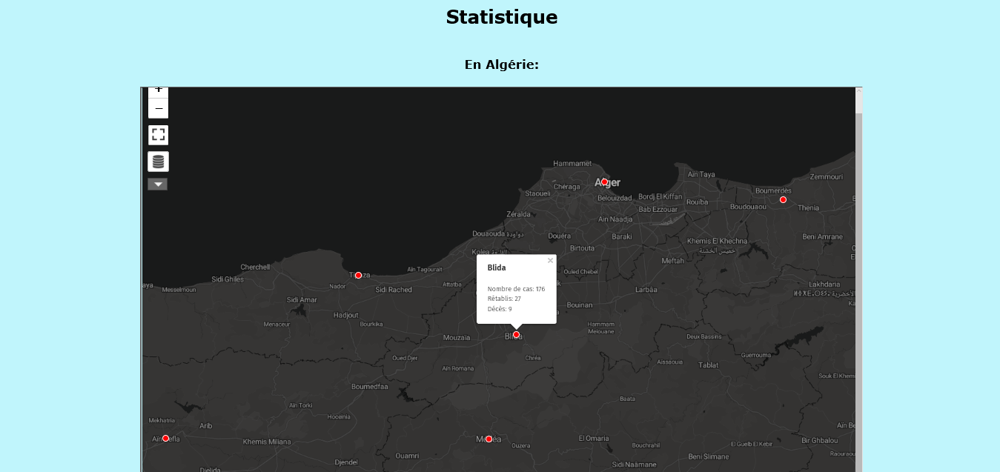
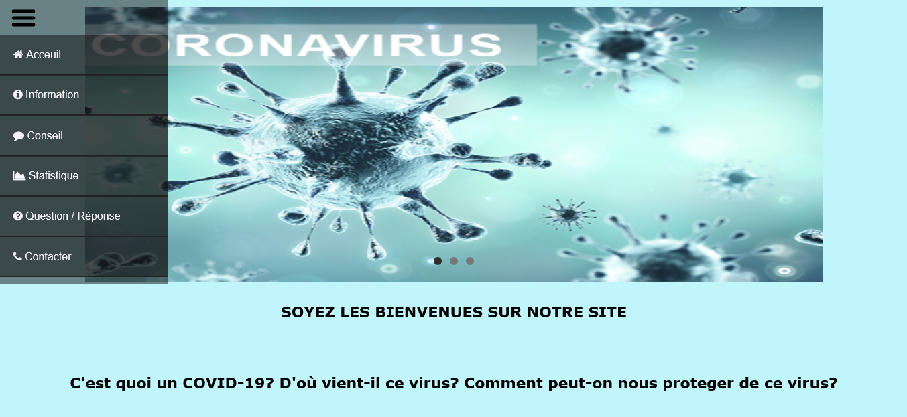
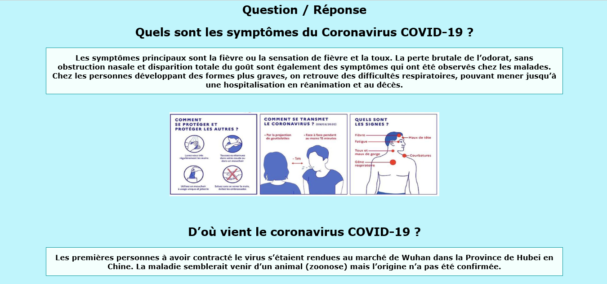
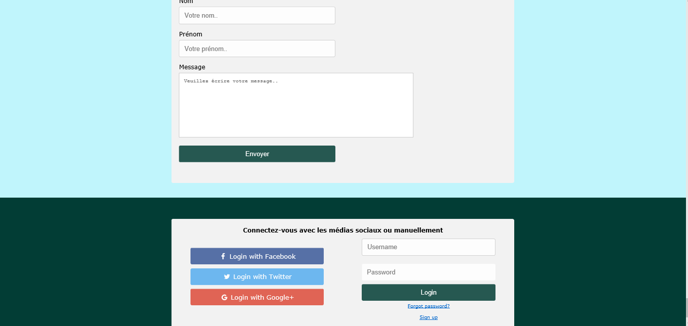

# REPOSITORY NAME

## PROJECT DESCRIPTION
This project is Web Site about Corona virus  

## Screenshots:

## Tools used:
* HTML
* CSS
* JS

## Team:
This project was made by:
[HamoudiSarra](https://github.com/HamoudiSarra)

## Contribution:
Feel free to `fork` this project and add whatever you like. If you have any suggestions or any comments please feel free to contact me or to open an issue, use free license art assets please.